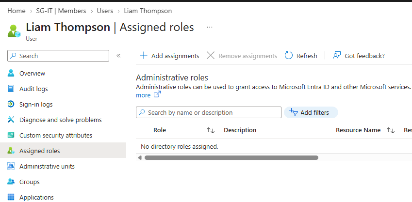
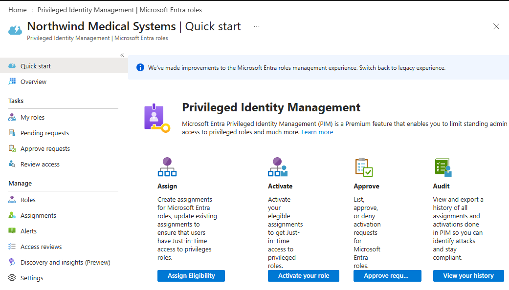
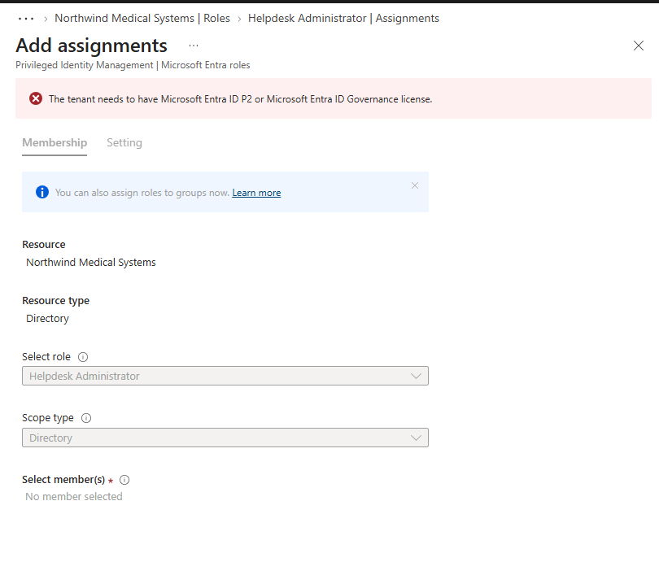
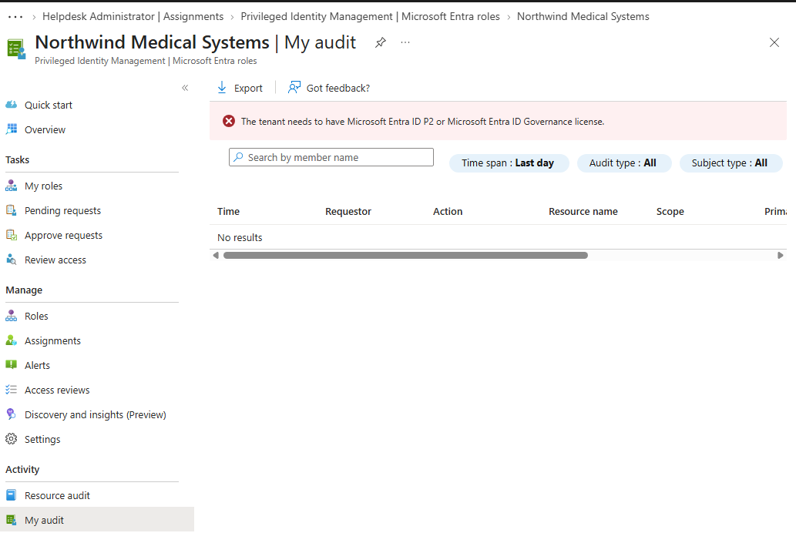

&nbsp;&nbsp;&nbsp;

<h1>Microsoft Entra ID - Privileged Access Management with JIT & PIM</h1>

In this lab, I designed a Just-in-Time (JIT) privileged access workflow using Microsoft Entra Privileged Identity Management (PIM). The objective was to reduce standing administrative privilege by allowing an administrator to remain eligible for a limited role and activate that privilege only when required.

The scenario focused on providing temporary Helpdesk Administrator access with additional controls including MFA, justification, approval, time-bound activation, early deactivation, and audit review.

Because the lab tenant did not include the Microsoft Entra licensing required to execute PIM assignments, the PIM configuration was evaluated and documented as a privileged access design rather than represented as a completed activation.

 

<h2>Environments and Technologies Used</h2>

- Microsoft Entra ID
- Microsoft Entra Privileged Identity Management (PIM)
- Microsoft Entra Administrative Roles
- Microsoft Entra Audit
- Just-in-Time (JIT) Privileged Access

<h2>IAM Concepts Demonstrated</h2>

- Privileged Identity Management (PIM)
- Just-in-Time (JIT) Access
- Least Privilege
- Eligible vs. Active Role Assignments
- Time-Bound Privileged Access
- Multi-Factor Authentication (MFA)
- Approval-Based Elevation
- Business Justification
- Standing Privilege Reduction
- Privileged Access Auditing

<h2>High-Level Steps</h2>

- Step 1. Establish the Current Privileged Access State
- Step 2. Review the PIM Privileged Access Workflow
- Step 3. Design an Eligible Helpdesk Administrator Assignment
- Step 4. Review Privileged Access Auditing

> [!IMPORTANT]
> Microsoft Entra PIM functionality requires premium licensing. The lab tenant exposed the PIM interface but did not provide the licensing required to complete an eligible role assignment. The lab therefore documents the proposed PIM policy and actual licensing boundary rather than simulating a completed PIM activation.

 

<h2>Actions and Observations</h2>

<b>1. ESTABLISH CURRENT PRIVILEGED ACCESS STATE</b>

The first stage established the user's existing privilege level before designing any administrative elevation.

Liam Thompson maintained his normal business access but had no Microsoft Entra administrative roles assigned. This provided a baseline with no permanent administrative privilege and demonstrated the desired starting point for a Just-in-Time access model.

 

 

> [!NOTE]
> Standard group and application access are separate from Microsoft Entra administrative roles. A user can maintain the business access required for their normal responsibilities without maintaining standing administrative privilege.

 

<b>2. REVIEW THE PIM PRIVILEGED ACCESS WORKFLOW</b>

Microsoft Entra Privileged Identity Management was reviewed to understand how privileged access would be managed throughout its lifecycle.

The PIM interface separates privileged access management into four primary areas: assignment, activation, approval, and auditing. Together, these stages support a workflow where administrative privilege can be made available when required without remaining permanently active.

 

 

The proposed privileged access lifecycle was:

<b>Eligible → Request Activation → Justification → MFA → Approval → Active → Deactivation/Expiration → Audit</b>

 

> [!NOTE]
> An eligible assignment does not mean the user currently possesses the elevated permissions. Eligibility allows the user to request activation when the administrative privilege is required.

 

<b>3. DESIGN AN ELIGIBLE HELPDESK ADMINISTRATOR ASSIGNMENT</b>

Helpdesk Administrator was selected as the proposed privileged role for the scenario rather than assigning the significantly broader Global Administrator role.

The intended PIM policy was designed with the following controls:

- Role: Helpdesk Administrator
- Assignment Type: Eligible
- Activation Model: Just-in-Time
- Maximum Activation Duration: 2 Hours
- MFA: Required
- Business Justification: Required
- Approval: Required
- Early Deactivation: Expected when privileged work is completed

This design applies least privilege in two dimensions: limiting both the level of privilege granted and the amount of time that privilege remains active.

 

 

> [!IMPORTANT]
> The PIM assignment could not be completed because the lab tenant did not contain the required premium licensing. The unavailable member selection and assignment workflow established the licensing boundary encountered during implementation.

 

> [!NOTE]
> Helpdesk Administrator was selected instead of Global Administrator because the scenario only required limited helpdesk capabilities. This reduces unnecessary privilege while still supporting the required administrative task.

 

<b>4. PRIVILEGED ACCESS AUDIT AND VERIFICATION</b>

The PIM audit interface was reviewed as the final stage of the privileged access lifecycle.

The audit view provides fields for information such as the requestor, action, resource, scope, target, subject, status, and time associated with privileged access activity.

No PIM activation records were generated because an eligible assignment could not be created under the available tenant licensing. The interface also identified the Microsoft Entra ID P2 or Microsoft Entra ID Governance licensing requirement.

 

 

> [!NOTE]
> In a licensed implementation, privileged access auditing provides context around elevation activity and supports review of who requested privileged access, what resource or role was involved, when the activity occurred, and the resulting status.

 

<h2>Proposed Privileged Access Policy</h2>

The final JIT/PIM design for the scenario was:

<b>Liam Thompson → Helpdesk Administrator → Eligible → JIT Activation → MFA → Business Justification → Approval → Maximum 2-Hour Activation → Early Deactivation When Complete → Audit Review</b>

The user would remain without active Helpdesk Administrator privileges during normal operations. When administrative access was required, the eligible role could be activated through the controlled PIM workflow.

If the administrative task was completed before the two-hour maximum duration, the role should be deactivated early rather than leaving unnecessary privileged access active until automatic expiration.

 

> [!IMPORTANT]
> Time-bound access is a maximum window, not a reason to retain privilege for the entire duration. Privileged access should be removed as soon as the business need ends.

 

<h2>Outcome</h2>

This lab demonstrated the design of a controlled privileged access lifecycle using Microsoft Entra PIM and Just-in-Time access principles.

Rather than providing permanent administrative permissions, the proposed model keeps the user eligible for a limited administrative role and introduces additional controls at the point of elevation. MFA strengthens identity verification, justification establishes the business reason, approval provides authorization, time limits reduce standing exposure, and auditing provides visibility into privileged activity.

Although premium licensing prevented the PIM assignment from being executed in the lab tenant, the exercise demonstrated the workflow, role-selection process, licensing boundary, security controls, and audit considerations involved in implementing JIT privileged access in Microsoft Entra ID.
